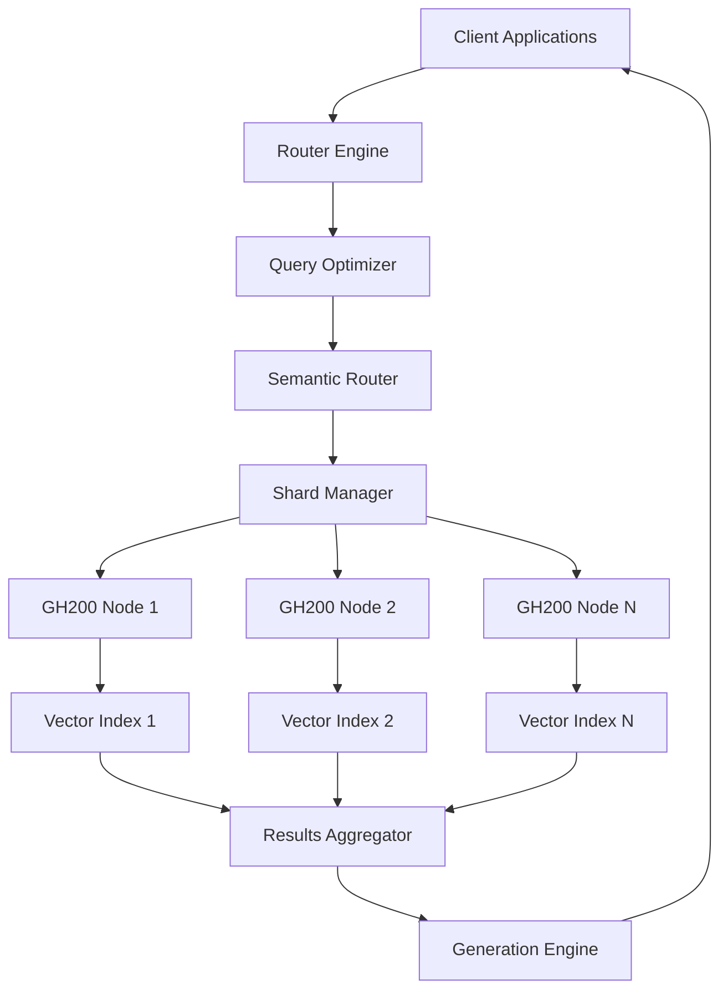

# GH200-Retrieval-Router Architecture

## System Overview

The GH200-Retrieval-Router is a high-performance retrieval-augmented generation (RAG) system designed specifically for NVIDIA GH200 Grace Hopper Superchip environments. The architecture leverages unified memory, NVLink fabric connectivity, and distributed sharding to enable efficient retrieval from massive vector databases.

## Core Components

### 1. Router Engine
- **Semantic Router**: Intelligent query routing based on embedding similarity
- **Load Balancer**: Distributes queries across available nodes
- **Query Optimizer**: Optimizes retrieval strategies based on query patterns

### 2. Memory Management
- **Grace Memory Manager**: Manages unified memory pools across CPU-GPU
- **Zero-Copy Transfers**: Eliminates memory copying between CPU and GPU
- **Dynamic Pool Allocation**: Adjusts memory allocation based on workload

### 3. Distributed Storage Layer
- **Shard Manager**: Handles automatic sharding across NVLink fabric
- **Vector Index Manager**: Manages FAISS, ScaNN, and RAPIDS indices
- **Metadata Store**: Distributed metadata storage with consistency guarantees

### 4. Communication Layer
- **NVLink Optimizer**: Optimizes inter-GPU communication patterns
- **NCCL Integration**: High-performance collective operations
- **Network Abstraction**: Abstracts InfiniBand, Ethernet, and NVLink

## Data Flow Architecture



## Memory Architecture

### Grace Hopper Unified Memory Model
- **480GB Unified Memory**: Shared between Grace CPU and Hopper GPU
- **900GB/s Memory Bandwidth**: High-bandwidth memory access
- **Zero-Copy Operations**: Direct GPU access to CPU memory

### Memory Pool Organization
```
┌─────────────────────────────────────────┐
│            Grace Memory (480GB)          │
├─────────────────────────────────────────┤
│  Embeddings Pool (300GB)                │
│  ├─ Shard 1 (10GB)                     │
│  ├─ Shard 2 (10GB)                     │
│  └─ ... (30 shards)                    │
├─────────────────────────────────────────┤
│  Cache Pool (100GB)                     │
│  ├─ Query Cache (40GB)                 │
│  ├─ Result Cache (40GB)                │
│  └─ Metadata Cache (20GB)              │
├─────────────────────────────────────────┤
│  Workspace Pool (80GB)                  │
│  ├─ Computation Buffer (40GB)          │
│  ├─ Communication Buffer (20GB)        │
│  └─ Temporary Storage (20GB)           │
└─────────────────────────────────────────┘
```

## Scaling Architecture

### Horizontal Scaling (Multi-Node)
- **NVLink-C2C**: 900GB/s inter-node connectivity
- **NCCL All-Reduce**: Efficient gradient synchronization
- **Dynamic Load Balancing**: Automatic workload distribution

### Vertical Scaling (Single Node)
- **Multi-GPU Utilization**: Leverage multiple GPUs per node
- **CUDA Streams**: Concurrent kernel execution
- **Memory Prefetching**: Overlapped data movement

## Security Architecture

### Data Protection
- **Encryption at Rest**: AES-256 encryption for stored vectors
- **Encryption in Transit**: TLS 1.3 for network communication
- **Access Control**: Role-based access control (RBAC)

### Network Security
- **VPC Isolation**: Network-level isolation
- **Firewall Rules**: Restricted port access
- **Certificate Management**: Automated certificate rotation

## Performance Optimization Strategies

### Index Optimization
- **Hierarchical Navigable Small World (HNSW)**: Fast approximate search
- **Product Quantization**: Memory-efficient vector compression
- **Inverted File Index**: Scalable exact search

### Communication Optimization
- **Ring AllReduce**: Bandwidth-optimal collective operations
- **Topology-Aware Routing**: NVLink topology optimization
- **Asynchronous Communication**: Non-blocking operations

### Memory Optimization
- **Memory Pool Reuse**: Avoid frequent allocations
- **Pinned Memory**: Eliminate page faults
- **Memory Mapping**: Efficient large file access

## Monitoring and Observability

### Key Metrics
- Query latency (p50, p95, p99)
- Throughput (QPS)
- Memory utilization (Grace, GPU)
- NVLink bandwidth utilization
- Cache hit rates

### Distributed Tracing
- **OpenTelemetry**: Standardized tracing
- **Jaeger Integration**: Distributed trace visualization
- **Custom Spans**: Fine-grained performance tracking

## Disaster Recovery

### Backup Strategy
- **Incremental Backups**: Efficient backup storage
- **Multi-Region Replication**: Geographic redundancy
- **Point-in-Time Recovery**: Granular recovery options

### High Availability
- **Active-Passive Failover**: Automatic failover
- **Health Checks**: Continuous health monitoring
- **Circuit Breakers**: Fault isolation

## Technology Stack

### Core Technologies
- **CUDA 12.3+**: GPU acceleration
- **NCCL**: Multi-GPU communication
- **UCX**: Unified communication framework
- **RAPIDS**: GPU-accelerated data science

### Vector Databases
- **FAISS**: Facebook AI Similarity Search
- **ScaNN**: Google's approximate nearest neighbor
- **RAPIDS cuVS**: GPU-accelerated vector search

### Machine Learning
- **PyTorch**: Deep learning framework
- **Transformers**: Pre-trained language models
- **Sentence-BERT**: Semantic embeddings

### Infrastructure
- **Kubernetes**: Container orchestration
- **Prometheus**: Metrics collection
- **Grafana**: Metrics visualization
- **Jaeger**: Distributed tracing